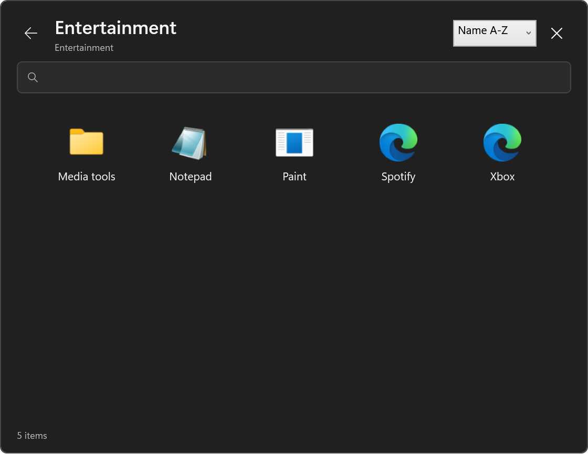

# LaunchTree

LaunchTree is a Windows PowerShell module that creates native Start shortcuts
for managed Entry Roots and opens their recursive content in a WPF Launcher.

The module is under active development. Its signed behavior and release gates
are defined in the [specifications](docs/specifications/README.md).



## Getting started

Follow the [getting-started guide](docs/getting-started.md) to build or install
the module, create a first Entry Root, reconcile its Start Entry, and verify the
Launcher. The [setup script](tools/Initialize-QuickStart.ps1) writes a default
machine configuration and a sample Entry Root of built-in Windows Launch Items.

## Content model

The default Managed Root is:

```text
C:\ProgramData\LaunchTree\LaunchTree
```

Every immediate directory becomes a Start Entry. Nested directories become
Menu Folders. `.lnk` files and HTTP(S) `.url` files become Launch Items.
Optional UTF-8 `description.txt` files provide Menu Folder tooltips.

## Commands

- `Get-LaunchTreeConfiguration`
- `Test-LaunchTree`
- `Update-LaunchTree`
- `Show-LaunchTree`
- `Get-LaunchTreeDiagnostic`
- `Export-LaunchTreeSupportBundle`
- `Remove-LaunchTree`

## Development

The project uses Sampler, Pester 5, ModuleBuilder, PSScriptAnalyzer, and
GitVersion. Run builds and tests through the detached launcher described in the
project instructions. The `Validate documentation` VS Code task checks the
Memory Bank, specification identifiers, references, links, and sign-off state.

## Project records

- [Signed Design Concept](docs/design-concept.md)
- [Functional requirements](docs/specifications/functional-requirements.md)
- [Configuration specification](docs/specifications/configuration.md)
- [Quality requirements](docs/specifications/quality-requirements.md)
- [Open issues](docs/open-issues.md)

## Operations

- [Getting started](docs/getting-started.md)
- [Deployment](docs/deployment.md)
- [Troubleshooting](docs/troubleshooting.md)
- [Machine configuration example](docs/examples/LaunchTree.json)
